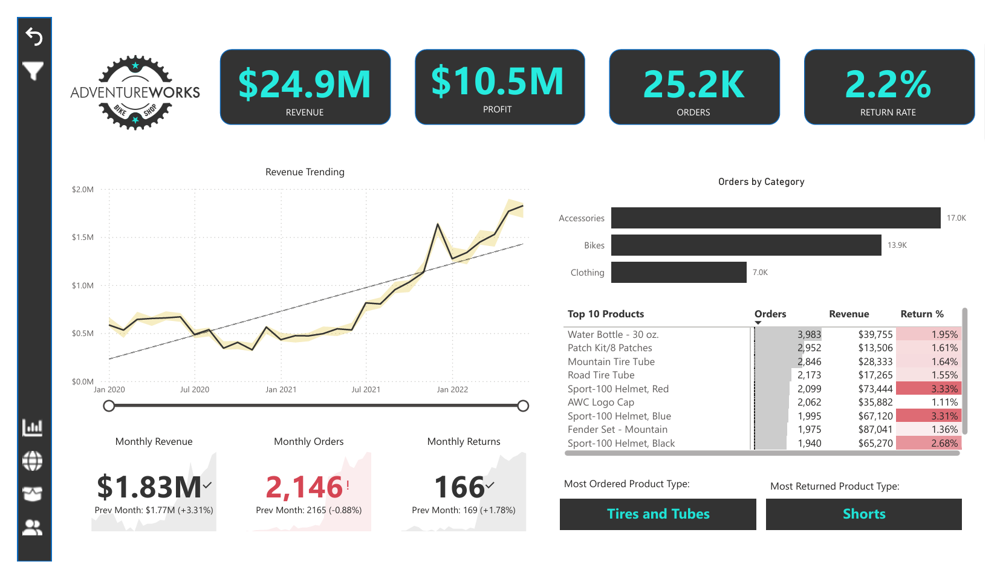
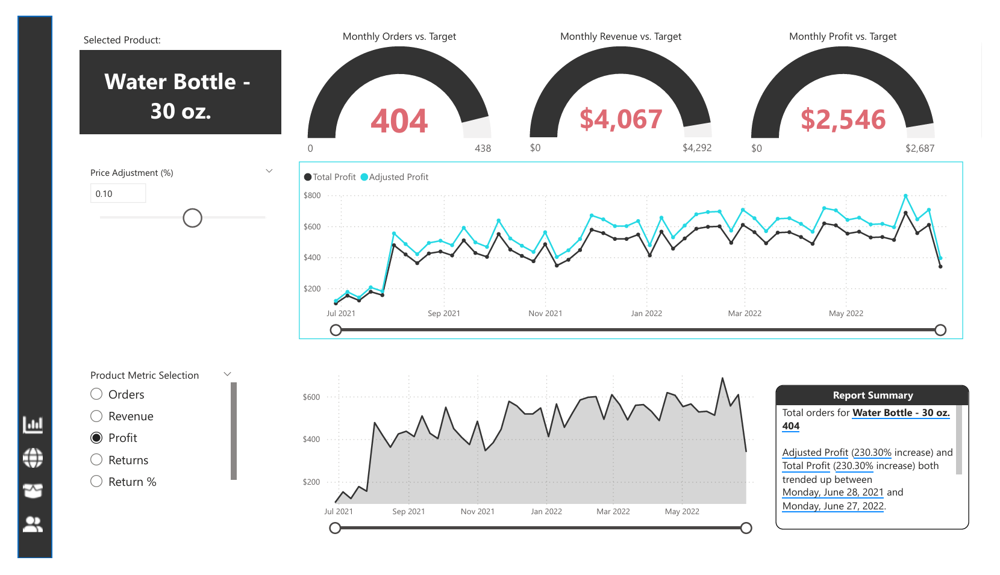
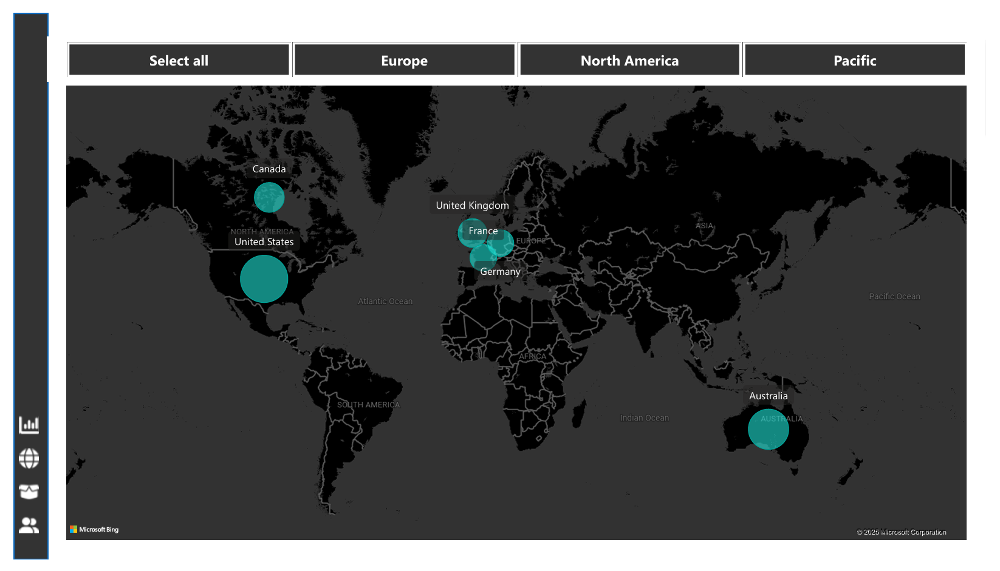
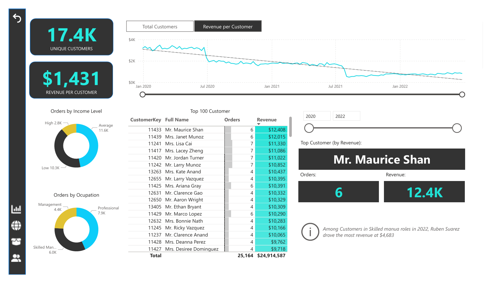

# Power BI Sales Dashboard – Business Analytics

## Overview
This project presents an interactive Power BI dashboard designed to analyze sales performance, customer behavior, product trends, and regional distribution. It transforms raw business data into meaningful insights to support data-driven decision-making.

## Problem Statement
Businesses generate large volumes of sales data, but without proper visualization, it becomes difficult to track performance, identify trends, and make informed decisions. This project aims to solve this problem by building an interactive dashboard that provides clear insights into business operations.

## Tools & Technologies
- Power BI  
- DAX  
- Power Query  
- Microsoft Excel  
- Data Modeling  

## Dataset
The dataset includes multiple business tables:
- Sales Data (2020–2022)  
- Customer Data  
- Product & Category Data  
- Territory Data  
- Returns Data  

## Key Metrics
- Revenue: $24.9M  
- Profit: $10.5M  
- Orders: 25.2K  
- Return Rate: 2.2%  

## Dashboard Features

### Sales Analysis
- Revenue trends over time  
- Monthly performance tracking  
- Orders by category  

### Product Analysis
- Top 10 products by revenue  
- Most ordered product type (Tires and Tubes)  
- Most returned product type (Shorts)  

### Customer Insights
- Total customers: 17.4K  
- Revenue per customer: $1,431  
- Top customer: Mr. Maurice Shan  
- Customer segmentation by income and occupation  

### Geographic Analysis
- Sales distribution across regions  
- Interactive map visualization  
- Region-based filtering  

## Visualizations

### Executive Dashboard

### Product & Sales Analysis

### Geographic Analysis

### Customer Insights

## Key Insights
- Revenue shows consistent growth over time  
- Accessories and Bikes drive the highest sales  
- Certain products have higher return rates  
- Professional customers contribute higher revenue  
- Seasonal trends impact sales performance  

## Business Impact
- Enables monitoring of business KPIs  
- Helps identify high-performing products and customers  
- Supports data-driven decision-making  
- Improves overall business strategy  

## Project Files
- powerbi_sales_dashboard.pbix  
- sales_data_2020.xlsx  
- sales_data_2021.xlsx  
- sales_data_2022.xlsx  
- customer_lookup.xlsx  
- product_lookup.xlsx  
- calendar_lookup.xlsx  
- returns_data.xlsx  
- territory_lookup.xlsx  

## How to Use
1. Open the .pbix file in Power BI Desktop  
2. Load dataset if required  
3. Use filters and slicers to explore insights  

## Future Improvements
- Real-time data integration  
- Dashboard deployment on Power BI Service  
- Predictive analytics  
- Enhanced drill-down features  

## Author
Rinku Patel  
Data Analyst | Power BI | SQL | Python | Tableau  
